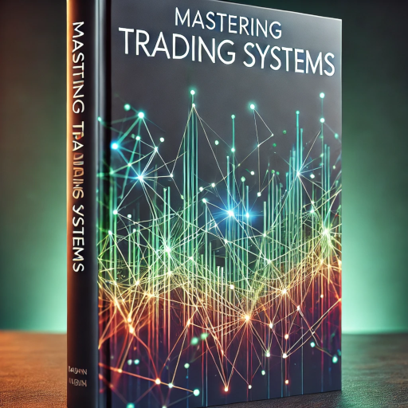

# [Mastering Trading Systems](https://mikelaud.github.io)

## Part I. Intro

1. [The New Trading for a Living](https://www.amazon.com/New-Trading-Living-Psychology-Discipline-ebook/dp/B00MFPZAWG) _(Alexander Elder)_
2. [The New Sell and Sell Short](https://www.amazon.com/New-Sell-Short-Profits-Declines-ebook/dp/B004PGMI14) _(Alexander Elder)_
3. [High Probability Trading Strategies](https://www.amazon.com/High-Probability-Trading-Strategies-Tactics-ebook/dp/B001KAM6U6) _(Robert C. Miner)_

## Part II. Foundation

4. [Market Beaters](https://www.amazon.com/Market-Beaters-Art-Collins-ebook/dp/B07NBX7T45) _(Art Collins)_
5. [Trading Systems: A new approach to system development](https://www.amazon.com/gp/product/B081Z8YLKT) _(Urban Jaekle, Emilio Tomasini)_
6. [Mastering Financial Pattern Recognition](https://www.amazon.com/Mastering-Financial-Pattern-Recognition-Sofien-ebook/dp/B0BJNQ13QN) _(Sofien Kaabar)_

## Part III. Advanced

7. [Beating the Financial Futures Market](https://www.amazon.com/Beating-FINANCIAL-FUTURES-MARKET-Strategies-ebook/dp/B01N3SG6TI) _(Art Collins)_
8. [Advances in Financial Machine Learning](https://www.amazon.com/Advances-Financial-Machine-Learning-Marcos-ebook/dp/B079KLDW21) _(Marcos López de Prado)_
9. [Algorithmic Trading with Python](https://www.amazon.com/Algorithmic-Trading-Python-Quantitative-Development/dp/B086Y6H6YG) _(Chris Conlan)_

---
%%
